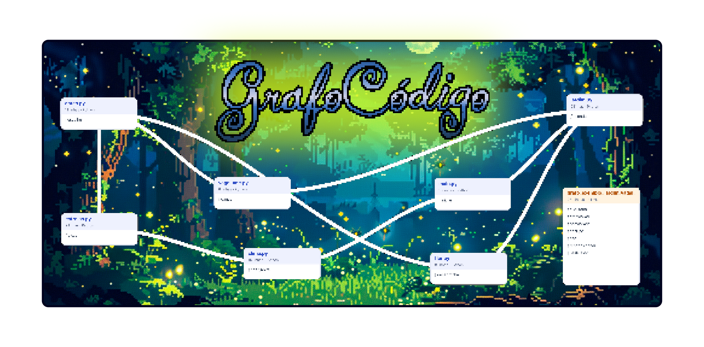

# 🕸️ GrafoCódigo

**Visualize as dependências do seu projeto de código em um grafo interativo.**

O **GrafoCódigo** analisa os arquivos de um projeto e gera um mapa visual das referências encontradas entre eles. A ferramenta ajuda a explorar a estrutura do código, entender dependências e navegar por projetos maiores de forma mais intuitiva.

> **Quer apenas usar a ferramenta?**
> Baixe o executável `.exe`, abra o programa e gere seu grafo.

---

## ✨ Recursos

* 🗂️ Analisa automaticamente os arquivos do projeto
* 🔗 Identifica referências entre arquivos
* 🐍 Analisa arquivos Python utilizando **AST**
* 🌐 Utiliza heurísticas documentadas para outras linguagens
* 🖱️ Gera um **grafo HTML interativo**
* 📊 Registra referências resolvidas, ambiguidades e erros
* 📄 Permite exportação para **SVG**, **JSON** e impressão em PDF
* 🔒 Realiza toda a análise **localmente**
* 📦 Possui versão portátil para Windows

---

## 🚀 Como usar

### 🪟 Windows

A maneira mais simples de utilizar o GrafoCódigo é pelo executável.

1. Acesse a página **Releases** deste repositório.
2. Baixe o arquivo `.exe` da versão mais recente.
3. Abra o **GrafoCodigo**.
4. Escolha a pasta do projeto que deseja analisar.
5. Escolha onde salvar o arquivo HTML.
6. Clique em **Gerar grafo**.
7. Abra o HTML gerado no navegador.

**Pronto.** Não é necessário instalar Python, bibliotecas ou outras dependências.

> **Observação:** dependendo das configurações de segurança do Windows, o sistema pode exibir um aviso ao executar um aplicativo baixado da internet.

---

## 🐍 Uso pelo terminal

Também é possível executar o GrafoCódigo diretamente pelo código fonte.

### Requisitos

* Python **3.9 ou superior**
* Nenhuma dependência externa obrigatória

### Gerar um grafo

```bash
python grafocodigo.py caminho/do/projeto --saida grafo_codigo.html
```

Depois da análise, abra `grafo_codigo.html` em qualquer navegador moderno.

O arquivo funciona **offline**.

### Gerar registro de auditoria

Para salvar também os detalhes da análise em JSON:

```bash
python grafocodigo.py caminho/do/projeto \
  --saida grafo_codigo.html \
  --auditoria grafo_codigo.audit.json
```

### Modo estrito

O modo estrito retorna o código de saída `3` quando encontra um erro de sintaxe ou uma referência ambígua:

```bash
python grafocodigo.py caminho/do/projeto --estrito
```

---

## 🧩 Como funciona

O GrafoCódigo percorre os arquivos textuais do projeto e procura referências que possam ser associadas a outros arquivos do mesmo projeto.

No grafo:

| Elemento     | Representação                                                   |
| ------------ | --------------------------------------------------------------- |
| 📄 **Bloco** | Um arquivo textual analisado                                    |
| ➡️ **Seta**  | Uma referência estática resolvida para outro arquivo do projeto |

A estratégia de análise varia de acordo com a linguagem.

### 🐍 Python

Arquivos Python são analisados utilizando **AST (Abstract Syntax Tree)**.

Isso permite identificar referências de forma mais estruturada e confiável.

As relações encontradas por esse método recebem **confiança alta**.

### 🌐 Outras linguagens

Outros tipos de arquivo são analisados utilizando regras heurísticas documentadas.

Como essas relações não podem ser determinadas com a mesma precisão da análise AST, elas podem receber **confiança média ou baixa**.

---

## 📊 Relatório de análise

Além do grafo visual, a ferramenta registra informações que ajudam a avaliar o resultado da análise.

O relatório pode incluir:

* arquivos ignorados;
* erros encontrados;
* referências resolvidas;
* referências não resolvidas;
* referências ambíguas;
* nível de confiança das relações encontradas.

Essas informações ajudam a diferenciar relações mais confiáveis de resultados que precisam de revisão.

---

## 📤 Exportação

O resultado pode ser utilizado em diferentes formatos:

| Formato  | Uso                                             |
| -------- | ----------------------------------------------- |
| **HTML** | Grafo interativo para exploração no navegador   |
| **SVG**  | Imagem vetorial para documentos e apresentações |
| **JSON** | Registro completo de auditoria                  |
| **PDF**  | Exportação utilizando a impressão do navegador  |

O HTML gerado funciona localmente e pode ser aberto **sem conexão com a internet**.

---

## ⚠️ O que o grafo representa

O GrafoCódigo representa **referências estáticas encontradas entre os arquivos do projeto**.

Uma conexão indica que a ferramenta encontrou uma referência que pôde ser associada a outro arquivo local.

Isso é útil para visualizar a estrutura e as relações existentes dentro de um projeto.

### O que ele não representa

O resultado **não é um grafo de chamadas**.

Ele também não demonstra o comportamento real do programa durante sua execução e não garante que determinada dependência será carregada em tempo de execução.

Por exemplo, o grafo não deve ser interpretado como prova de que:

* uma função será executada;
* determinado arquivo será carregado;
* uma condição específica será atingida;
* o fluxo de execução seguirá as conexões exibidas.

O resultado deve ser entendido como um **mapa estrutural de referências estáticas do código**.

---

## 🔒 Privacidade

Toda a análise acontece **localmente no seu computador**.

O código fonte completo não é incorporado ao HTML gerado.

No entanto, o relatório pode conter informações sobre a estrutura do projeto, incluindo:

* nomes de arquivos;
* caminhos de arquivos;
* nomes de classes;
* nomes de funções;
* contagens de linhas;
* referências resolvidas;
* hashes SHA-256.

Por isso, revise o relatório antes de compartilhar o mapa de um projeto confidencial.

**Links simbólicos são ignorados por padrão.**

---

## ⚠️ Limitações conhecidas

Nenhuma análise estática consegue representar perfeitamente todos os comportamentos possíveis de um projeto.

No GrafoCódigo, algumas limitações importantes são:

* heurísticas podem produzir falsos positivos e falsos negativos;
* imports externos aparecem como não resolvidos quando não correspondem a um arquivo local;
* conteúdo binário é ignorado;
* arquivos maiores que **5 MiB** são ignorados e registrados;
* macros não são interpretadas;
* resolução dinâmica pode não ser identificada;
* aliases configurados por ferramentas externas podem não ser resolvidos;
* dependências carregadas dinamicamente em tempo de execução podem não aparecer no grafo.

Por esses motivos, o grafo deve ser revisado antes de ser compartilhado ou utilizado como documentação definitiva do projeto.
